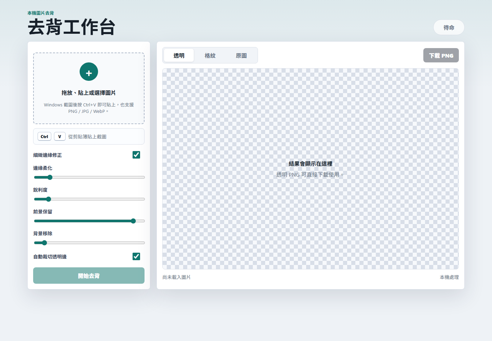

# 本機去背工具

一個可攜式的 Windows 本機去背網站。支援拖放圖片、選擇檔案、直接貼上 Windows 截圖，使用 `rembg/u2net` 在本機 CPU 上完成去背，不需要 OpenAI API 或雲端服務。



## 功能特色

- 本機處理圖片，不需要上傳到外部服務
- 支援 PNG、JPG、WebP
- 支援 `Ctrl + V` 直接貼上 Windows 截圖
- 可調整邊緣柔化、銳利度、前景保留、背景移除
- 可下載透明背景 PNG
- 可讓同一個 Wi-Fi / 區網內的其他使用者連線使用
- 提供 `.bat` 啟動檔，解壓縮後雙擊即可啟動

## 快速啟動

最簡單方式：直接雙擊

```text
啟動去背工具.bat
```

如果想用 PowerShell 手動啟動：

```powershell
powershell -ExecutionPolicy Bypass -File .\run.ps1
```

啟動後瀏覽器會開啟：

```text
http://127.0.0.1:5000
```

## 使用方式

1. 開啟網站。
2. 拖放圖片、選擇圖片，或使用 Windows `Win + Shift + S` 截圖後按 `Ctrl + V` 貼上。
3. 視需要調整銳利度、邊緣柔化等參數。
4. 按下「開始去背」。
5. 按「下載 PNG」保存透明背景圖片。

## 同網路共享

網站會綁定 `0.0.0.0:5000`，所以同一個 Wi-Fi 或區網內的其他裝置可以連線使用。

啟動時終端機會顯示類似：

```text
LAN URL for other devices on the same network:
  http://192.168.1.23:5000
```

把這個網址傳給同網路使用者即可。

如果其他人無法連線，通常是 Windows 防火牆擋住。`run.ps1` 會嘗試自動新增 TCP 5000 防火牆規則；若仍失敗，請手動允許私人網路的 TCP port `5000`。

## 打包搬到別台電腦

在原電腦執行：

```powershell
powershell -ExecutionPolicy Bypass -File .\make_zip.ps1
```

會產生：

```text
background-remover-portable.zip
```

把 zip 複製到新電腦、解壓縮，然後雙擊 `啟動去背工具.bat` 即可。

## 環境需求

- Windows
- 第一次啟動需要網路，用來安裝 Python 套件與下載 `rembg` 模型
- 若新電腦沒有 Python，`run.ps1` 會嘗試透過 `winget` 自動安裝 Python 3.11

## 技術

- Python Flask
- rembg / u2net
- onnxruntime CPU
- Pillow
- HTML / CSS / JavaScript

## 不會提交到 GitHub 的內容

以下檔案已在 `.gitignore` 排除：

```text
.venv/
__pycache__/
*.log
*.zip
*.onnx
```
